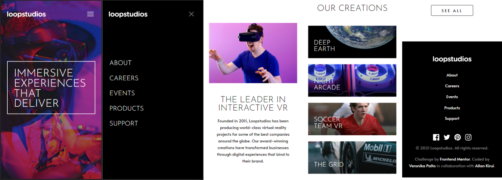

# Frontend Mentor - Loopstudios landing page solution

A collaborative project.

This is a solution to the [Loopstudios landing page challenge on Frontend Mentor](https://www.frontendmentor.io/challenges/loopstudios-landing-page-N88J5Onjw). Frontend Mentor challenges help you improve your coding skills by building realistic projects.

## Table of contents

- [Overview](#overview)
  - [The challenge](#the-challenge)
  - [Screenshots](#screenshots)
  - [Links](#links)
- [Our process](#our-process)
  - [Built with](#built-with)
  - [What we learned](#what-we-learned)
  - [Continued development](#continued-development)
  - [Useful resources](#useful-resources)
- [Authors](#authors)
- [Acknowledgments](#acknowledgments)

## Overview

### The challenge

Users should be able to:

- View the optimal layout for the site depending on their device's screen size
- See hover states for all interactive elements on the page

### Screenshots


Screenshot of the _Header_ and _Footer_ sections coded by [Allan Kirui](#authors).


Screenshot of the _Hero_ and _Gallery_ sections coded by [Veronika Palto](#authors).



Screenshot of the general overview of the site in mobile view.

### Links

- Solution URL: [Add solution URL here](https://your-solution-url.com)
- Live Site URL: [Netlify](https://hungry-kilby-fc41c0.netlify.app/)

## Our process

- [Ak] - [Veronika](#authors) set up the base project by _creating the GitHub repository_, _setting up global styling_, _including the required assets_, and so on. I then proceeded to code the _header_ and _footer_ sections of the project and after I was done, she took over and worked on the _Hero_ and _Gallery_ sections.

  During the entire project life cycle we exchanged thoughts and ideas on how to make the project meet web standards and kept track of our overall progress.

### Built with

- Semantic HTML5 markup
- CSS Grid
- CSS Flexbox
- Desktop-first workflow
- JavaScript ES6
- [Inkscape](https://inkscape.org) - Inkscape: Open Source Scalable Vector Graphics Editor

### What We learned

- [AK] - Before this project, I had no idea that you could set mutliple images to show for different screen sizes using the `<picture>` element.

```html
<picture>
	<source media="(min-width: 767px)" srcset="./static/images/desktop/image-interactive.jpg" />
	
</picture>
```

### Continued development

- [AK] - I want to apply the features and best practices that I've learnt from working on this project to future projects.

### Useful resources

## Authors

- GitHub - [Veronika Palto](https://www.github.com/JepardMay)
- GitHub - [Allan Kirui](https://www.github.com/AllanKirui)

## Acknowledgments

- [AK] - Personally, I believe that being self taught and working alone on projects sometimes has a way of making you _tunnel visioned_. Working with someone has made me learn to think outside of the box in more ways than one. [Veronika](#authors) is an amazing developer. She stresses on good, clean code and definitely pays attention to the details.

[Back to top](#frontend-mentor---loopstudios-landing-page-solution)
